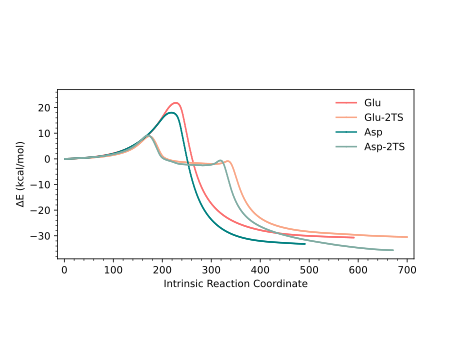

# irc-graph
Silly little program that converts intrinsic reaction coordinate (IRC) data (simulated only) into a minimum energy parth (MEP) plot showing the difference in electronic energy vs the intrinsic reaction coordinate. The energetic profile depicted in the graph represents the electronic energy in kcal /mol-1 obtained from IRC calculations

### Required files (all in the same directory)
- Python file [irc.py](irc.py) (or jupyter notebook file [irc.ipynb](irc.ipynb))
- csv file with your own concentration (x) vs time (y) data:

|Intrinsic Reaction coordinate|	1TS_Glu (kcal/mol)|	2TS_Glu	1TS_Asp|	1TS_Asp (kcal/mol)|	2TS_Asp (kcal/mol)|
| :-------------------------: | :---------------: | :------------: |:-----------------: | :---------------: |
|1	                          |0                  |0               |0	                  |0                  |
|2	                          |0.00628	          |0.006275	       |0.00627	            |0.00628	          |
|3	                          |0.01255	          |0.01255	       |0.01255	            |0.01255	          |
|4	                          |0.01883	          |0.018825	       |0.01882	            |0.0251	            |
|...                          |...	              |...  	         |...   	            |...    	          |

### Launch python program
- linux: `python3 irc.py`
- windows terminal (PowerShell): `python3 .\irc.py`

## Modeled minimum energy paths (MEP) plot 

